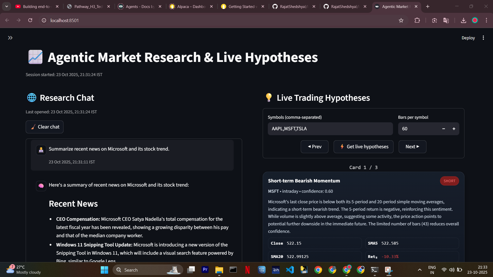
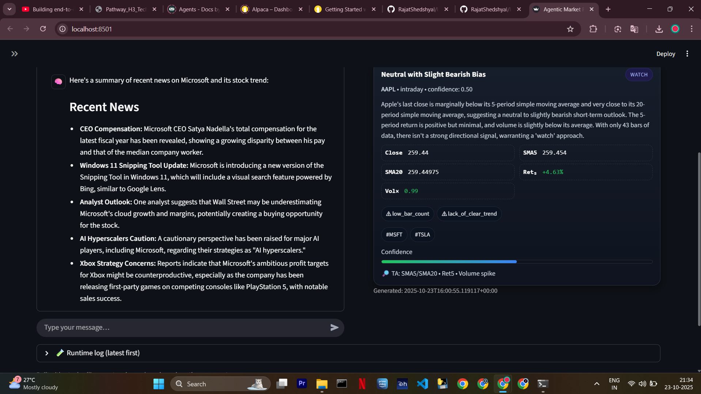
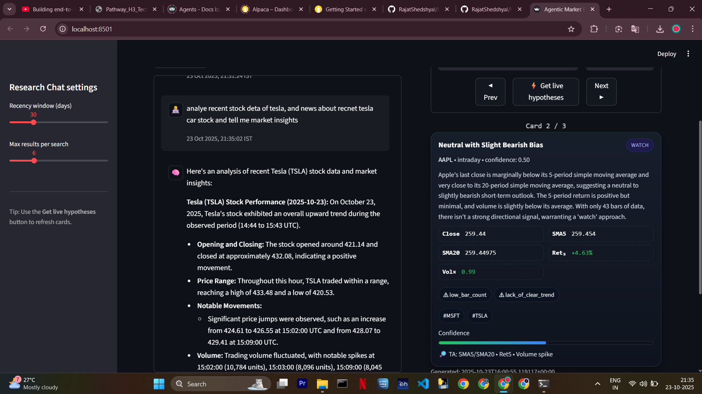

# 📊 Welcome to the Agentic Market Research & Hypotheses Tool

This project combines **live market data ingestion** with an **agentic AI research interface**.

With it, you can:

- Ask natural questions like:
  - *“Tell me about Tesla stocks”*  
  - *“can u get me stock details like opening and closing of tesla stocks? → how did u do it?”*  
  - *“Summarize recent news on Microsoft and its stock trend.”*  
  - *"analye recent stock deta of tesla, and news about recnet tesla car stock and tell me market insights"*
- Get **AI-generated trading hypotheses** (LONG/SHORT/WATCH) with confidence scores, rationale, and risk factors, shown right beside your research chat.

---

## 📺 Demo Video
[▶️ Watch the demo](./demo_video_compressed.mp4)

## 📸 Screenshots





## 🚀 How to use

1. **Run the live data ingestor**:  
   A background script (`alpaca_live_ingest.py`) fetches 1-minute bars from the Alpaca IEX feed and continuously updates your local SQLite database (`store/market.sqlite`).

2. **Launch the Streamlit UI**:  
   The web app (`streamlit_app.py`) gives you:
   - A **Research Chat** for free-form Q&A (uses `web_search` + `market_snapshot` tools).  
   - A **Hypotheses carousel** that shows AI-generated trading hypotheses for your chosen symbols.

3. **Interact with the system**:
   - Use the **chat box** to ask questions about markets, companies, or symbols.  
   - Use the **hypotheses panel** to request AI-generated insights (based on recent bar data stored in SQLite).  
   - Navigate hypotheses using **Prev/Next** buttons.  

👉 Together, you get both **search-driven research** and **data-driven hypotheses** in one tool.

---

## 🛠️ Project Overview

### Two main processes

1. **Data ingestor** (`alpaca_live_ingest.py`):  
   - Pulls 1-minute bars from Alpaca’s **IEX free feed**.  
   - Stores them into a local SQLite database (`market_bars` table).  
   - Runs continuously, updating every minute.

2. **Streamlit UI** (`streamlit_app.py`):  
   - **Research Chat** (Q&A using `web_search` + `market_snapshot`).  
   - **Live Trading Hypotheses** (generated via `agent.py` + `market_snapshot` tool).  

> Bars are densest during **Regular Trading Hours (RTH)** (09:30–16:00 ET). Outside RTH, the ingestor falls back to the most recent completed session.

---

## 📂 Repo structure

```
.
├─ .env                      # your secrets and config (see below)
├─ requirements.txt          # Python dependencies
├─ alpaca_live_ingest.py     # Alpaca → SQLite ingestor (1-min bars, IEX)
├─ streamlit_app.py          # UI (Research Chat + Hypothesis carousel)
├─ agent.py                  # tool-calling agents: hypotheses + research chat
├─ tools.py                  # your @tool functions (market_snapshot, web_search)
└─ store/
   └─ market.sqlite          # created automatically on first run
```

---

## 🔑 Prerequisites

- Python **3.10+** (tested on **3.13.5**).  
- An **Alpaca** account (API keys) for market data.  
- A **Google API key** for Gemini (used with `langchain_google_genai`).  

---

## ⚙️ Environment variables (`.env`)

Create a `.env` file in the project root:

```ini
# --- Alpaca ---
ALPACA_KEY_ID=your_alpaca_key_id
ALPACA_SECRET_KEY=your_alpaca_secret

# Symbols to ingest (comma-separated)
SYMBOLS=AAPL,MSFT,TSLA

# Optional: SQLite DB path (default: store/market.sqlite)
DB_PATH=store/market.sqlite

# --- LLM (Gemini) ---
GOOGLE_API_KEY=your_google_api_key
```

---

## 🧩 Virtual environment setup

### macOS/Linux
```bash
python -m venv .venv
source .venv/bin/activate
```

### Windows (PowerShell)
```powershell
py -m venv .venv
.\.venv\Scripts\Activate.ps1
```

### Install dependencies
```bash
pip install -U pip
pip install -r requirements.txt
```
---

## ▶️ Running the system

Open **two terminals** (activate your virtual environment in both).

### 1. Start the Alpaca ingestor
```bash
python alpaca_live_ingest.py
```

Expected logs:
```
✅ Connected to DB at store/market.sqlite
✅ Tracking symbols: ['AAPL', 'MSFT', 'TSLA']
Fetched rows: 120 | symbols: ['AAPL', 'MSFT', 'TSLA']
📥 Upserted 120 rows at 2025-10-23T13:45:00+00:00 | window: 2025-10-23T13:30:00Z → 2025-10-23T13:45:00Z
```

### 2. Launch the Streamlit UI
```bash
streamlit run streamlit_app.py
```

Open the local URL (usually `http://localhost:8501`) and:

- Ask questions in **Research Chat** (e.g., *“What’s new with Tesla?”*).  
- Generate trading ideas with **⚡ Get live hypotheses**.  
- Explore insights with **Prev/Next** navigation.

---

## 🧠 How the agent works

### Hypotheses agent
- **Always calls** the `market_snapshot(symbols=[...], window=int)` tool first.  
- Returns **strict JSON** with hypotheses.

### Research chat agent
- Can call `web_search` and/or `market_snapshot`.  
- Returns **Markdown answers with sources** for transparency.  

---
